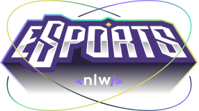
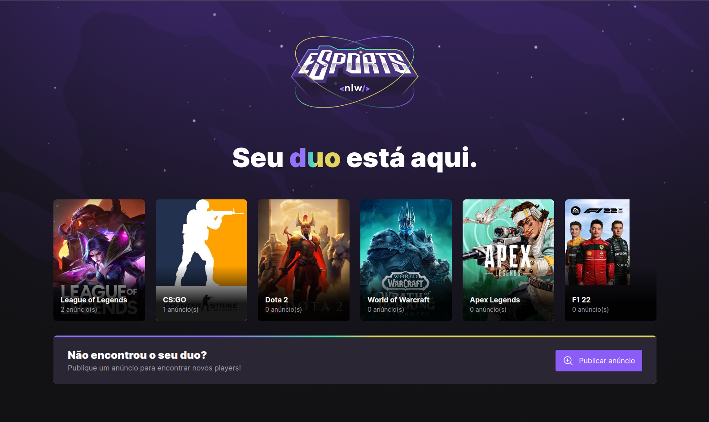
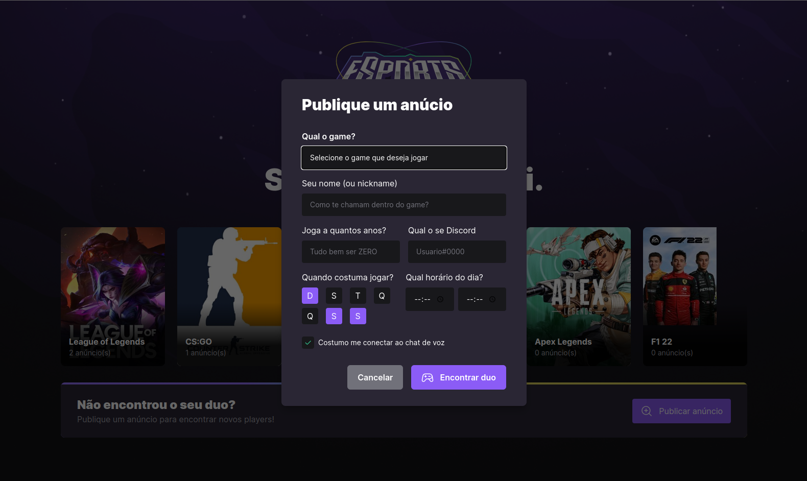

# NLW eSports Ignite

    

**Nesta NLW** 

    Buscando juntar os dois mundos (Game e Programação), a NLW eSports é uma das mais incríveis criada pela Rocketseat, tanto web quanto mobile. Durante a semana desenvolvemos um projeto inédito do universo de games usando as tecnologias mais atuais do mercado.

**✅ tecnologias usadas**

    
    
    
    
    
    
          
    
    
    

 

**e também:**

- Hosppscotch
- Radix Ui
- Prisma
- Axios
- Cors
- Phosphor Icons

 

    <h3>LandingPage</h3>
    

    <h3>Modal</h3>
    

